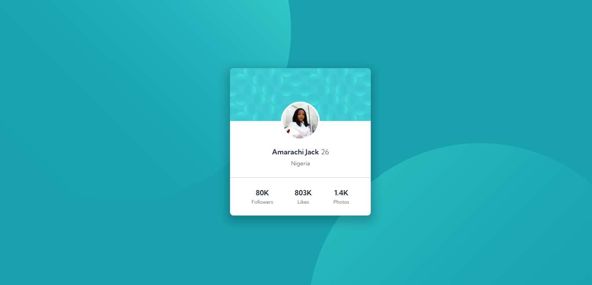

 # HerTechtrail_cohort 7_project for Amarachi Jack

This is a solution to the [HerTechtrail_cohort 7_project for Amarachi Jack](https://amarajack.github.io/Amarachi_jack_porfolio_site/).

## Table of contents

- [Overview](#overview)
  - [Screenshot](#screenshot)
  - [Links](#links)
- [My process](#my-process)
  - [Built with](#built-with)
  - [What I learned](#what-i-learned)
  - [Continued development](#continued-development)
- [Author](#author)
- [Acknowledgments](#acknowledgments)

## Overview

### Screenshot


### Links

- Solution URL: [Add solution URL here](https://github.com/Amarajack/Amarachi_jack_porfolio_site)
- Live Site URL: [Add live site URL here](https://amarajack.github.io/Amarachi_jack_porfolio_site/)

## My process

### Built with

- Semantic HTML5 markup
- CSS media queries
- Flexbox
- Bootstrap
- Javascript 

### What I learned

I used my knowledge of html, media queries, javascript, bootstrap and css to build a functional and dynamic portfolio to showcase my expertise, and during the process i got a deeper knowledge and understanding of bootstrap and also a more flexible way of using javascript.

```html
<a
								href="https://amarajack.github.io/profile-card/"
								target="_blank"
								rel="noopener noreferrer"
							>
								<div class="exhibit position-relative">
									

									<div
										class="position-absolute top-0 overlay-bg d-flex align-items-center justify-content-center"
									>
										<div class="display-info">
											<h1>Profile Card</h1>
											<p
												>I joined the 20 days of code challenge for frontend
												mentor and i was able to create a profile card.</p
											>
										</div>
									</div>
								</div>
							</a>
```

```css
.overlay-bg {
	left: 0;
	right: 0;
	height: 100%;
	background: rgba(0, 0, 0, 0.8);
	opacity: 0;
	transition: all 350ms linear;
	padding: 30px;
	text-align: center;
}

.exhibit:hover .overlay-bg {
	opacity: 1;
}

.display-info {
	transition: all 200ms linear;
	transform: translateX(-100%);
}
```

### Continued development

I will continue to use my knowledge to make further improvements in different projects i intend to work on in the future.

## Author

- Behance- [@Amarajack](https://www.behance.net/amarachijack)
- LinkedIn - [Amarachi Jack](https://www.linkedin.com/in/amarachi-jack-654680165)


## Acknowledgments

I want to appreciate my mentor @princessmaggy for her apts, explanatory coaching and encouragement during the process of my training. I'm so glad to have learned all that I have and I look forward to learning more. Thank you coach for your resilience.

